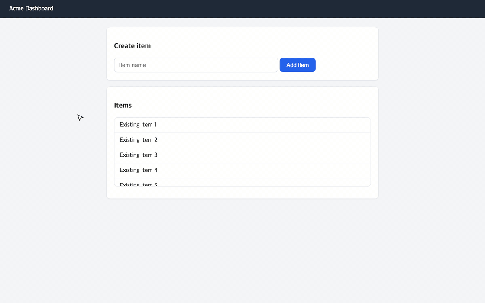

# filmless

Screen recording you can edit like code. Record a real session in your web app once, then retime it, move a camera over it, and render a crisp, deterministic GIF — from the same take, forever.

**Live demo (not a video — the actual DOM replay with edit sliders): [filmless.vercel.app](https://filmless.vercel.app)**



*This GIF was rendered by filmless itself: one recorded session, auto-edited by `filmless suggest`.*

## Why

- **Screen recordings are single-use.** Want the zoom 0.3s later? Re-record everything.
- **filmless records the DOM, not pixels** (via [rrweb](https://github.com/rrweb-io/rrweb)). The edit is a JSON file. The render is a pure function of time — byte-identical every run, at any resolution.
- Think [vhs](https://github.com/charmbracelet/vhs), but for web apps instead of terminals.

## Quickstart

```sh
npm i -g filmless      # needs Node 20+, Chrome, ffmpeg

filmless record http://localhost:3000   # interact with your app, Ctrl+C when done
filmless suggest                        # drafts reel.json: auto-zooms on clicks, cuts idle time
filmless render -o demo.gif             # headless re-render → palette-optimized GIF
```

Preview and tune the edit live:

```sh
filmless preview        # http://localhost:4300 — edit reel.json, refresh
```

## The edit file

`reel.json` is the whole edit. Version it next to your code.

```jsonc
{
  "session": "session.json",
  "output": { "file": "demo.gif", "width": 1120, "fps": 30, "gifFps": 20, "colors": 96 },

  // session time (ms): speed through or cut the boring parts
  "retime": [
    { "from": 4200, "to": 9800, "speed": 4 },
    { "from": 12000, "to": 15000, "cut": true }
  ],

  // output time: [t, centerX, centerY, zoom] — repeat a keyframe to hold the shot
  "camera": [
    [0,    960, 540, 1.0],
    [1200, 960, 540, 1.0],
    [1700, 640, 380, 1.5],
    [3500, 640, 380, 1.5]
  ],

  "cursor": { "show": true, "clickRipples": true, "smooth": 120 }
}
```

`filmless suggest` generates a draft from your session (zoom toward clicks, collapse gaps > 2s, wide bookends). Then you just adjust numbers.

## Commands

```
filmless record <url>  [-o session.json] [--viewport 1280x800] [--canvas]
filmless suggest [session.json] [-o reel.json]
filmless render  [reel.json | session.json] [-o demo.gif] [--frames a,b] [--mp4] [--auto]
filmless preview [reel.json] [--port 4300]
```

- `render session.json` with no reel = plain 1x render.
- `--frames 120,180` renders a slice for fast iteration.
- `--auto` = suggest + render in one shot.

## How it works

1. `record` opens your app in Chrome and captures every DOM mutation, input, scroll, and mouse move as [rrweb](https://github.com/rrweb-io/rrweb) events. Data, not pixels — so text stays text.
2. `render` rebuilds the session in headless Chrome and steps it frame by frame with `replayer.pause(t)` — each frame is a pure function of time. CSS transitions are disabled at replay so nothing depends on wall-clock. Camera is a single `transform` on a wrapper; the cursor is synthetic and smoothed.
3. ffmpeg packs the frames with a diff-based palette (`palettegen stats_mode=diff` + `paletteuse diff_mode=rectangle`) — UI demos with static backgrounds compress extremely well.

The official rrweb→video tool ([rrvideo](https://github.com/rrweb-io/rrvideo)) plays the session in real time and screenshots on a timer — dropped frames, no editing. Stepping virtual time instead is the whole trick.

## Limitations (honest ones)

filmless replays the DOM, so anything that never enters the DOM never renders:

- cross-origin iframes (Stripe checkout, embedded YouTube)
- `<video>` pixel content — playback events replay, pixels don't
- browser-native UI: file pickers, permission prompts, `<select>` popups
- canvas requires `--canvas` at record time (heavier sessions)
- native desktop apps — for terminals, use [vhs](https://github.com/charmbracelet/vhs)

## Requirements

- Node ≥ 20
- Chrome/Chromium/Edge (auto-discovered; override with `CHROME=/path/to/chrome`)
- ffmpeg on PATH (`brew install ffmpeg` / `apt install ffmpeg`)

## License

MIT
